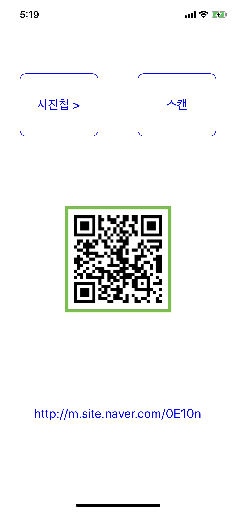

# **[React-Native] QR코드 이미지 읽기**

<br>
<br>
<br>

# 📚 사용 모듈

- react-native-image-picker
- react-native-qr-decode-image-camera
    - react-native-camera / 의존성 모듈

<br>
<br>
<br>

# 🏷 버전 정보

- node: v12.13.1
- yarn: 1.22.4
- react-native: 0.61.5

<br>
<br>
<br>


# 🏷 프로세스

1. 디바이스 갤러리(사진첩)에서 사진을 선택하여 이미지 경로를 state에 저장한다.
2. qr reader 모듈을 이용해 qr 코드 내용 결과 값을 확인한다.

<br>
<br>
<br>


# 1. 모듈 설치

```bash
yarn add react-native-image-picker react-native-qr-decode-image-camera react-native-camera

npx pod-install
```

- `react-native-image-picker`: 디바이스 갤러리(사진첩)에서 이미지를 가져오는 모듈
- `react-native-qr-decode-image-camera`: 이미지내 QR을 분석해 내용물을 가져오는 모듈
- `react-native-camera`: 위 `react-native-qr-decode-image-camera` 모듈의 의존성 모듈
- pod install 하여 종속성 모듈을 설치해준다.

<br>
<br>
<br>


# 2. 디바이스 갤러리에서 이미지 가져오기

```jsx
const handleOnPress = () => {
    try {
      ImagePicker.launchImageLibrary(
        {
          storageOptions: {
            path: 'images',
          },
          title: '사진을 선택하세요',
        },
        response => {
          if (response.didCancel) {
            console.log('취소함');
          } else if (response.error) {
            console.log('에러 : ', response.error);
          } else {
            const source = {uri: response.uri};

            setImage(source);
          }
        },
      );
    } catch (e) {
      console.log(e);
    }
  };
```

- 이미지를 가져와 저장된 경로를 state에 저장한다.

<br>
<br>
<br>

# 3. QR 이미지 내용 가져오기

```jsx
const decodeImage = async () => {
    try {
      QRreader(image.uri)
        .then(data => {
          setResult(data);
        })
        .catch(e => {
          console.log({e});
          setResult(null);

          return Alert.alert('알림', '스캔을 실패하였습니다.');
        });
    } catch (e) {
      console.log(e);
    }
  };
```

- state에 저장한 이미지를 이용해 QR 이미지 내용을 가져온다.

<br>
<br>
<br>


# ✨ 앱 스크린샷


